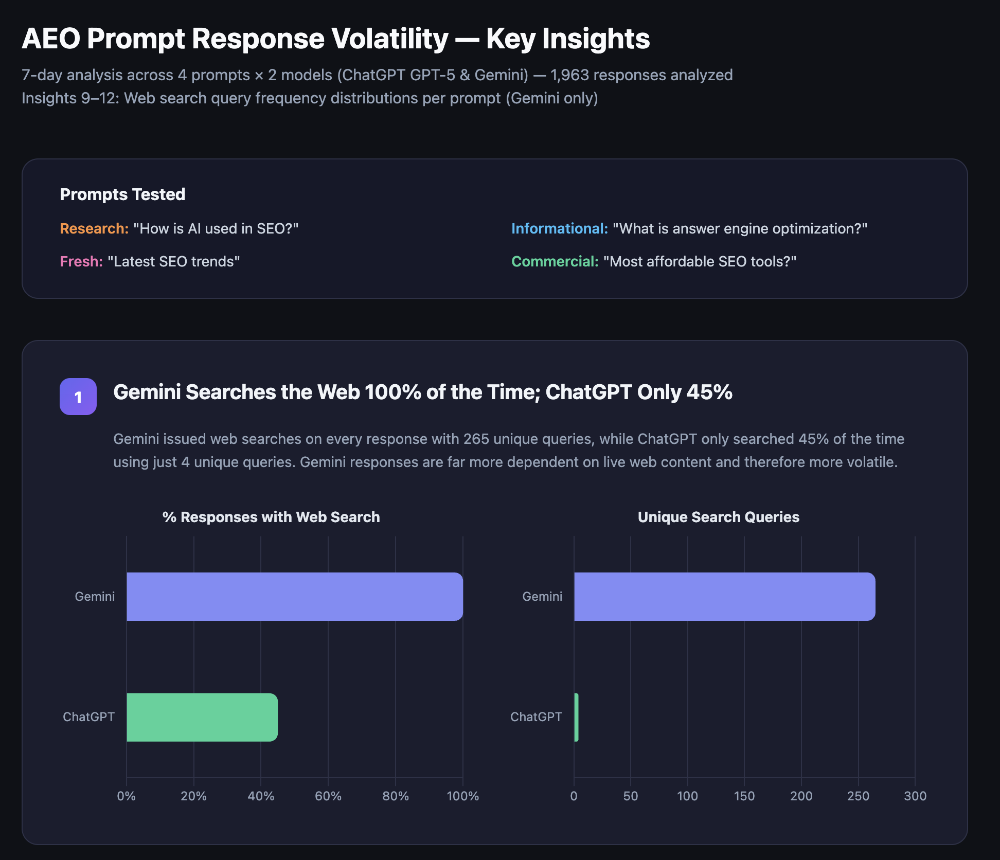
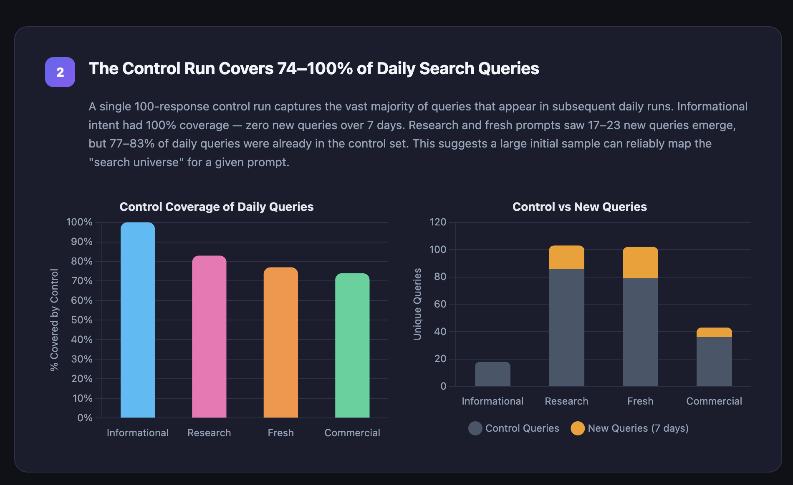

# AEO Skills — Answer Engine Optimization for AI Agents

A suite of open-source skills that help AI agents optimize content for **Answer Engines** (ChatGPT, Gemini, Perplexity, etc.). Built for [OpenClaw](https://openclaw.ai) agents but designed to be adaptable to any agent framework.

**Default model:** All skills that call the Gemini API default to **`gemini-3-flash-preview`** — the model powering Google Search AI Mode and AI Overviews. Using the same model Google uses means your measurements reflect real-world AI Overview behavior.

**Default sample count:** 20 runs per prompt. AI responses are probabilistic; a single run can miss mentions that appear 30-40% of the time. 20 samples balances accuracy with API cost.

## Why Gemini Is the Only Model That Matters for AEO (Right Now)

We ran a 7-day study across 4 prompt types × 2 models (ChatGPT GPT-5 and Gemini), analyzing 1,963 responses. The results are clear: **optimizing for Gemini is the only AEO strategy that makes sense today.**

### Gemini searches the web 100% of the time. ChatGPT only ~45%.

Gemini issued web searches on **every single response** and used **265 unique search queries**. ChatGPT only searched **45% of the time** with just **4 unique queries total**. That's a 66× difference in search diversity.



**What this means:** Gemini's responses are deeply dependent on live web content — your content's presence (or absence) in search results directly determines whether Gemini cites you. ChatGPT mostly relies on its parametric knowledge and rarely searches, making it nearly impossible to influence through content optimization alone.

**Why ChatGPT doesn't search much:**
- **Cost** — Web search is expensive at ChatGPT's scale. Every search query adds latency and API costs. OpenAI has strong economic incentives to minimize search usage.
- **Legal risk** — There are ongoing concerns about ChatGPT searching Google at scale. Google could restrict or litigate over systematic scraping of search results, so OpenAI keeps search usage conservative.
- **Architecture** — ChatGPT was designed as a parametric model first, with search as an optional enhancement. Gemini was built with Google Search as a native, always-on capability.

### A single 20-sample run captures 74–100% of query diversity

Our control run analysis shows that a single batch of responses captures the vast majority of the search query universe for any given prompt. Informational prompts had **100% coverage** — zero new queries over 7 days. Even dynamic prompts (research, fresh, commercial) showed **74–83% coverage** from the initial sample.



**This is why we default to 20 samples.** It's enough to reliably map the query landscape for a prompt — catching most of the search queries Gemini will use, without burning excessive API credits.

### The bottom line

If you're doing AEO/GEO today, **focus on Gemini**. It's the model that:
1. **Always searches the web** — your content can actually influence its responses
2. **Powers Google AI Overviews** — the largest answer engine by traffic (25% of Google searches trigger AI Overviews)
3. **Uses diverse search queries** — creating multiple pathways for your content to get discovered and cited
4. **Is measurable** — the Gemini API with grounding lets you simulate exactly what the model does, so you can test and iterate

ChatGPT's limited search behavior means traditional SEO and brand authority matter more for getting cited there. But Gemini? That's where content optimization has the most direct, measurable impact.

---

## Skills

### Core Pipeline

The AEO loop: **Research → Create → Measure → Repeat**

| Skill | Description | Link |
|-------|-------------|------|
| **aeo-prompt-research-free** | Discover which AI prompts matter for a brand. Crawls a site, analyzes positioning, generates prioritized prompts, and audits content coverage. No API keys required. | [→ Skill](./aeo-prompt-research-free/) |
| **aeo-content-free** | Create or refresh content that AI assistants want to cite. Researches what models currently cite, builds a competitive brief, and produces citation-worthy content. No API keys required. | [→ Skill](./aeo-content-free/) |
| **aeo-analytics-free** | Track whether AI assistants mention and cite a brand over time. Measures visibility, detects trends, and identifies opportunities. Uses Gemini API free tier with grounding. | [→ Skill](./aeo-analytics-free/) |

### Analysis Tools

Understand how AI models search and what they cite.

| Skill | Description | Link |
|-------|-------------|------|
| **prompt-frequency-analyzer** | Analyze which search queries Gemini triggers when answering a prompt. Runs it multiple times with Google Search grounding and reports frequency distribution. | [→ Skill](./prompt-frequency-analyzer/) |
| **prompt-question-finder** | Find question-based Google Autocomplete suggestions for any topic. Prepends 13 question modifiers (what, how, why, will, are, do…) to discover what people actually ask. | [→ Skill](./prompt-question-finder/) |
| **aeo-grounding-query-mapper** | Map the exact search queries Gemini fires — with query clustering, pattern analysis, batch mode, and cross-prompt overlap detection. Upgraded version of prompt-frequency-analyzer. | [→ Skill](./aeo-grounding-query-mapper/) |

### Simulation & Monitoring

Simulate AI Overviews, compare AI models, and track competitors.

| Skill | Description | Link |
|-------|-------------|------|
| **aeo-ai-overview-simulator** | Simulate Google AI Overviews by running prompts through Gemini 3 Flash with grounding. See which sources get cited, how often, and track a specific domain's citation rate. | [→ Skill](./aeo-ai-overview-simulator/) |
| **aeo-citation-gap-finder** | Compare what Google AI cites vs what web search surfaces. Find cross-platform citation gaps between Gemini, ChatGPT, and Perplexity. | [→ Skill](./aeo-citation-gap-finder/) |
| **aeo-competitor-monitor** | Track competitor citations in AI Overviews over time. Append-only data file with trend analysis and citation share reports. | [→ Skill](./aeo-competitor-monitor/) |

### Optimization

Improve your content's AI-readiness.

| Skill | Description | Link |
|-------|-------------|------|
| **aeo-schema-optimizer** | Analyze pages and generate structured data (JSON-LD) optimized for AI citation. Includes templates for Article, FAQ, HowTo, Product, LocalBusiness, and BreadcrumbList. | [→ Skill](./aeo-schema-optimizer/) |

### Advanced Strategy

Deep analysis for competitive AEO.

| Skill | Description | Link |
|-------|-------------|------|
| **aeo-source-authority-profiler** | Analyze why certain sources get cited. Fetches top-cited pages and profiles them (word count, schema, freshness, entities) to build a "citation blueprint." | [→ Skill](./aeo-source-authority-profiler/) |
| **aeo-cannibalization-detector** | Detect when your own pages compete against each other for the same AI prompts. Scores severity and recommends consolidation or differentiation. | [→ Skill](./aeo-cannibalization-detector/) |
| **aeo-freshness-decay-tracker** | Track how citation rates change over time. Detects content decay, correlates with freshness, and flags pages needing urgent refresh. | [→ Skill](./aeo-freshness-decay-tracker/) |
| **aeo-entity-extractor** | Extract the specific entities (brands, people, stats, tools) that Gemini mentions in responses. Find entity gaps in your content. | [→ Skill](./aeo-entity-extractor/) |
| **aeo-multi-prompt-strategy** | Find authority hub pages cited across multiple prompts. Optimize one page to win many prompts instead of building separate pages for each. | [→ Skill](./aeo-multi-prompt-strategy/) |

## The AEO Loop

These skills form a complete AEO workflow:

```
1. RESEARCH  →  2. CREATE/REFRESH  →  3. MEASURE  →  4. STRATEGIZE  →  (repeat)
     ↑                                                       |
     └───────────────────────────────────────────────────────┘
```

1. **Research** (`aeo-prompt-research-free`) — Find what questions people ask AI about your industry
2. **Analyze** (`prompt-frequency-analyzer`, `aeo-grounding-query-mapper`, `prompt-question-finder`) — Understand how AI models search and what they cite
3. **Create** (`aeo-content-free`, `aeo-schema-optimizer`) — Write content and add structured data optimized for AI citations
4. **Simulate** (`aeo-ai-overview-simulator`, `aeo-citation-gap-finder`) — Preview how your content performs in AI Overviews
5. **Measure** (`aeo-analytics-free`, `aeo-competitor-monitor`, `aeo-freshness-decay-tracker`) — Track your visibility, competitors, and content decay over time
6. **Profile** (`aeo-source-authority-profiler`, `aeo-entity-extractor`) — Understand WHY top sources get cited and what entities to include
7. **Strategize** (`aeo-multi-prompt-strategy`, `aeo-cannibalization-detector`) — Find authority hub opportunities and fix self-competition
8. **Repeat** — Use strategy insights to prioritize research and content creation

## Usage

Each skill has a `SKILL.md` with full instructions. Drop them into your agent's skills directory and they're ready to go.

### OpenClaw

```bash
# Install via ClawHub
clawhub install clearscope/aeo-prompt-research-free
clawhub install clearscope/aeo-content-free
clawhub install clearscope/aeo-analytics-free
clawhub install clearscope/aeo-ai-overview-simulator
clawhub install clearscope/aeo-citation-gap-finder
clawhub install clearscope/aeo-grounding-query-mapper
clawhub install clearscope/aeo-competitor-monitor
clawhub install clearscope/aeo-schema-optimizer
clawhub install clearscope/aeo-source-authority-profiler
clawhub install clearscope/aeo-cannibalization-detector
clawhub install clearscope/aeo-freshness-decay-tracker
clawhub install clearscope/aeo-entity-extractor
clawhub install clearscope/aeo-multi-prompt-strategy
```

### Other Frameworks

Each skill is a self-contained directory with:
- `SKILL.md` — Instructions the agent follows (the "prompt")
- `references/` — Supporting docs and templates
- `scripts/` — Helper scripts (where applicable)

Read the `SKILL.md` files to understand the methodology, then adapt to your agent's tool-calling conventions.

## Requirements

- `web_search` — Any web search tool (Brave, Google, etc.)
- `web_fetch` — URL fetching / scraping capability
- LLM reasoning — The agent's own model
- **Gemini API key** (free from [aistudio.google.com](https://aistudio.google.com)) — Required for skills that use Gemini grounding (simulator, analyzers, monitors, analytics). Set as `GEMINI_API_KEY` env var.
- **Brave Search API key** (optional) — Used by citation-gap-finder for web search comparison. Set as `BRAVE_API_KEY` env var.

## License

MIT
